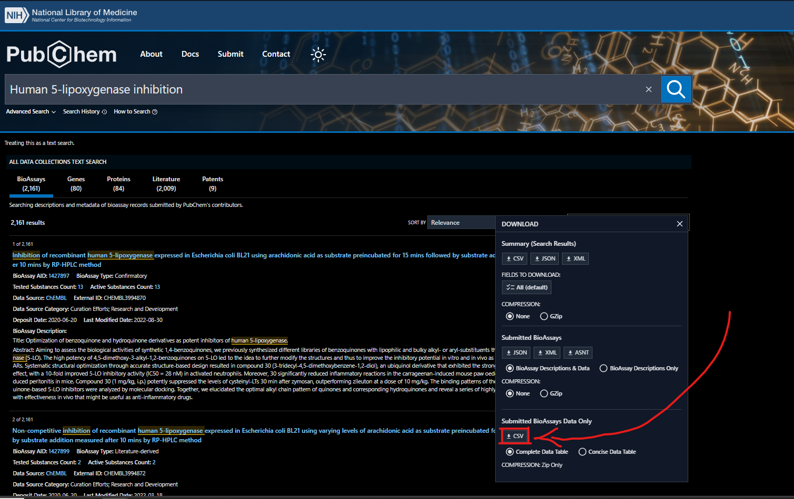

# BioAssaysCleanData
Repo para limbieza de data molecular obtenido desde pubchem 

Los datos de la carpeta [BioAssays ](./BioAssays)  Fueron descargados en pubchem con la siguiente busqueda: https://pubchem.ncbi.nlm.nih.gov/#query=Human+5-lipoxygenase+inhibition

en la opcion "Download" justo en la opción que se muestra en la siguiente imagen: 

Se orienta a los investigadores a explorar las otras opciones descarga por si hay nuevas formas de obtener 
