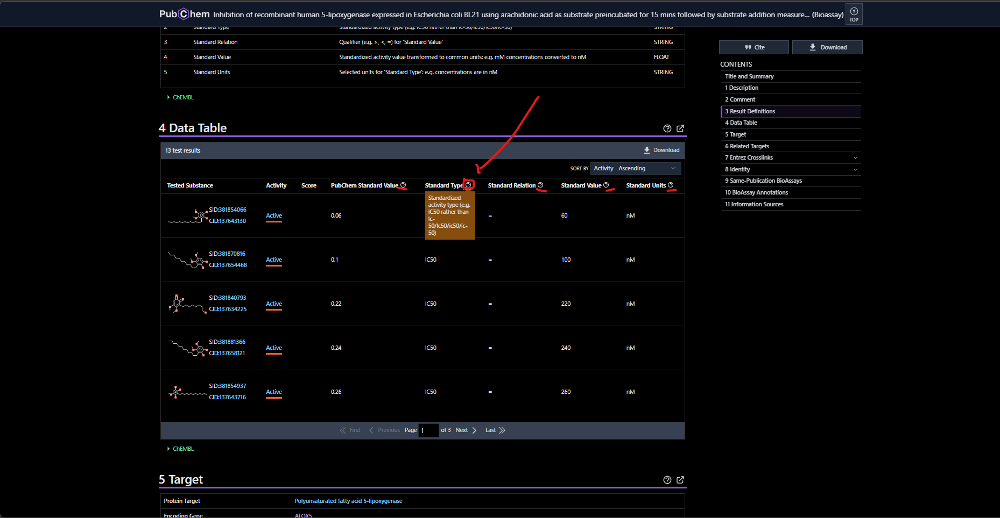

# BioAssaysCleanData

## Introducción
Repo para limbieza de data molecular obtenido desde pubchem 

Los datos de la carpeta [BioAssays ](./BioAssays)  Fueron descargados en pubchem con la siguiente busqueda: https://pubchem.ncbi.nlm.nih.gov/#query=Human+5-lipoxygenase+inhibition

en la opcion "Download" justo en la opción que se muestra en la siguiente imagen: 

Se orienta a los investigadores a explorar las otras opciones descarga por si hay nuevas formas de obtener los datos y documentarlas de igual manera.

con esos datos ya se puede ejecutar el codigo de `main.py` el cual generá un archivo con todos los csv que estan en la carperta de [BioAssays ](./BioAssays) y así mismo un reporte de como se estructuran todos los csv, columnas, valores unicos y demas cosas que se pueden encontrar en el archivo [merge_report](merge_report.txt).

> muy importante será analizar el archivo ya generado de merge_report y que se mire como se distribuyen los archivos, cuales son los valores de interes y que se cree un mejor diseño de un csv limpio donde se puedan identificar las moleculas como activas o inactivas siguiendo la normativa del `IC50` (INVESTIGUE QUE ES) u otra dependiendo el ensayo.

## Resumen cientifico de los datos

Los datos en la tabla son datos que se caracterizaron en un ensayo cientifico, en la carpeta de `BioAssays` uno encuentra muchos csv cada uno que empieza por su `AID_*` lo que sigue despues de eso es el ID por el cual se puede buscar en pubchem formateando el link de la siguente manera:

https://pubchem.ncbi.nlm.nih.gov/bioassay/aqui_va_el_ID_(que_es_el_nuemro_que_sigue_despues_de_"AID_")

y tendremos acceso a la tabla  donde veremos todo formateado de una manera mas clara y podremos mirar describciones de la tabla como se muestra en la siguiente imagen:

Aquí podras investigar y verificar aquellas tablas o BioAssays que esten raros desde el csv y poder indentificar como se están parsiando y asi idear una metodologia que permita todos los diferentes BioAssays tenerlos formateados o parseados de igual manera y una data más limpia.

> Podras identificar que colunmas no son de interes pq solo existen en muy pocos csv y demas cosas.

